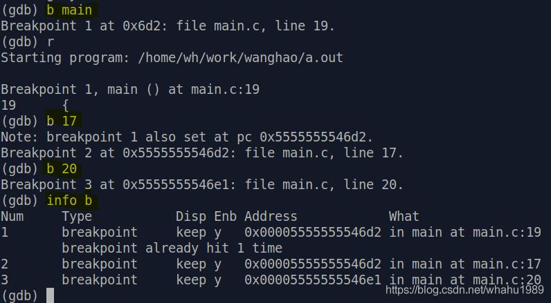
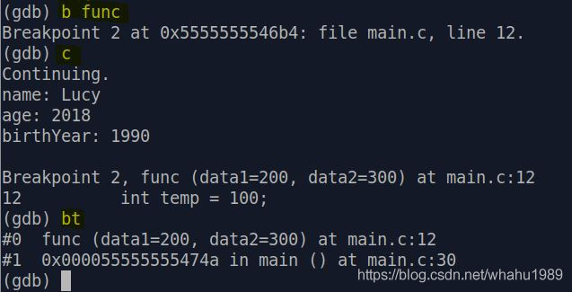

我们在linux下调试程序时，一般都会用到gdb，本文主要介绍一下gdb常用的操作命令以及TUI模式的使用方式。

## 常用操作命令
假设我们有段程序叫`main.c`，代码如下:
```C++ {.line-numbers}
#include <stdio.h>

typedef struct {
    char name[8];
    int age;
    int birthYear;
} student;


int func(int data1, int data2)
{
    int temp = 100;

    return temp + data1 + data2;
}


int main(void)
{
    student obj = {
        .name = "Lucy",
        .age  = 2018,
        .birthYear = 1990
    };
	
    printf("name: %s\n", obj.name);
    printf("age: %d\n", obj.age);
    printf("birthYear: %d\n", obj.birthYear);

    int ret = func(200, 300);
    printf("ret: %d\n", ret);

    return 0;
}
```
对main.c进行编译，并开启-g选项生成调试信息，这样gdb才可以调试程序 
`gcc -g main.c`  
编译ok后生成a.out。我们开始调试，在terminal下输入`gdb ./a.out`，打印如下，  
  
此时处于命令模式，我们可以输入相关命令来进行调试。下面列出常用的调试命令，
- **b xx**，设置断点（b是breakpoint的缩写），可以是`b 函数名`，即在指定函数的起始处设置断点，也可以是`b 行号`，即在指定代码行设置断点。
- **r**，运行的意思（r是run的缩写），一般用来代码开始运行，或者重新运行（如果调试到一半又想从头开始运行）
- **c**，继续执行（c是continue的缩写），当执行**r**运行到某个断点后，后面想继续执行到下一个断点或者把剩下代码执行完毕，就可以使用**c**
- **n**，next的意思，执行当前行代码
- **s**，step的意思，当一行代码里有函数调用，那么执行**s**会跳入函数里执行，如果没有函数调用，那么效果和**n**相同
- **info xx**，查看一些信息，如断点或者局部变量，分别是`info b`和`info locals`
- **p xx**，p是print的缩写，打印某个变量的值
- **set xx**，设置某个变量的值
- **x 指定大小 起始内存地址**，即查看起始内存地址上指定大小的内存里的值。如x /3b 0x11223344，就是查看以0x11223344开始的3个字节的值，也可以是x /3w 0x11223344，就是查看以0x11223344开始的3个word的值
- **bt**，backtrace的缩写，回溯，当使用s进入某个函数后，输入bt可以打印该函数的栈帧
- **list**，在命令行下显示源码，可以是`list`或者`list 行号`，后者是以指定行号为基准，显示该行号前后的代码
- **q**，quit的意思，即退出gdb调试

有了上面的内容，我们就来尝试调试。

---
**简单调试**
输入`b main`并回车，意思是在main函数起始处打断点，然后输入`r`并回车，开始执行程序，程序会在main开始处停下来，因为这边设置了断点。  
  
这套操作是调试的基础，因为程序运行都从main函数开始执行，所以我们都会从main开始调试。
这套操作是调试的基础，因为程序运行都从main函数开始执行，所以我们都会从main开始调试。

此时输入`n`并回车，程序就会执行一行代码。每输入一个n并回车，都会执行一行代码。如果一行代码有函数调用，那么输入`s`就会进入函数体内，如果输入`n`则直接把被调函数执行完。  

--- 
**查看变量**
除此之外，我们还可以查看变量，我们输入`p obj`，


查看结构体里的成员则是`p obj.name`，`p obj.age`,同时我们也可以查看其中的变量和变量中成员的的地址。

---
**修改变量**
我们也可以修改变量的值，
修改obj里成员变量的值，使用`set obj.age=1024`  
  
这个命令就是直接修改内存里的值，这样如果后续代码没有对这个变量重新赋值，那么后面这个变量的值就是我们手动设置的值了。  

**查看断点和局部变量**

我们可以使用`info b`来查看断点信息，如果想删除某个断点，就是用`delete Num`，这个Num就是使用info查看到的索引（最左侧的Num一列


查看局部变量是查看当前函数内的局部变量，使用`info locals`就可以了。

---
**查看栈帧**
代码里调用了func，我们先给func打个断点，然后使用`c`让代码运行到该断点，然后输入`bt`来查看  

这里可以看到2个栈帧，一个是func的，一个是main的，因为func是被main调用的。
这里可以看到2个栈帧，一个是func的，一个是main的，因为func是被main调用的。


## 小结
以上介绍了gdb的一些常用操作，对于命令的使用方法也可以在gdb命令行下使用help 命令来查看帮助信息。
由于作者平时都是使用IDE编程，很少使用GDB，所以这篇文章写的很浅显。之后应该会补充。