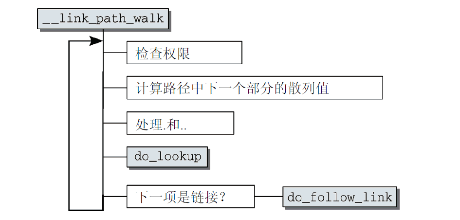

## 引言

**简介：** Linux 允许众多不同的文件系统共存，并支持跨文件系统的文件操作，这是因为有虚拟文件系统的存在。虚拟文件系统交换器，即VFS（Virtual Filesystem Switch）是 Linux 内核中的一个软件抽象层。它通过一些数据结构及其方法向实际的文件系统如 ext2，vfat 提供接口机制。

## 数据结构

### 一些基本概念

- 文件 一组在逻辑上具有完整意义的信息项的系列。在Linux中，除了普通文件，其他诸如目录、设备、套接字等 也以文件被对待。总之，“一切皆文件”。
- 目录 目录好比一个文件夹，用来容纳相关文件。因为目录可以包含子目录，所以目录是可以层层嵌套，形成 文件路径。在Linux中，目录也是以一种特殊文件被对待的，所以用于文件的操作同样也可以用在目录上。
- 目录项 在一个文件路径中，路径中的每一部分都被称为目录项；如路径/home/source/helloworld.c中，目录 /, home, source和文件 helloworld.c都是一个目录项。
- 索引节点 用于存储文件的元数据的一个数据结构。文件的元数据，也就是文件的相关信息，和文件本身是两个不同 的概念。它包含的是诸如文件的大小、拥有者、创建时间、磁盘位置等和文件相关的信息。
- 超级块 用于存储文件系统的控制信息的数据结构。描述文件系统的状态、文件系统类型、大小、区块数、索引节 点数等，存放于磁盘的特定扇区中。
如上的几个概念在磁盘中的位置关系如图所示。


### vfs数据结构

VFS依靠四个主要的数据结构和一些辅助的数据结构来描述其结构信息，这些数据结构表现得就像是对象；每个主要对象中都包含由操作函数表构成的操作对象，这些操作对象描述了内核针对这几个主要的对象可以进行的操作。

#### 超级块对象

存储一个已安装的文件系统的控制信息，代表一个已安装的文件系统；每次一个实际的文件系统被安装时，内核会从磁盘的特定位置读取一些控制信息来填充内存中的超级块对象。一个安装实例和一个超级块对象一一对应。 超级块通过其结构中的一个域`s_type`记录它所属的文件系统类型。  

```C++{.line-numbers}
struct super_block { //超级块数据结构
       struct list_head s_list;                /*指向超级块链表的指针*/
        ……
       struct file_system_type  *s_type;       /*文件系统类型*/
       struct super_operations  *s_op;         /*超级块方法*/
        ……
        struct list_head         s_instances;   /*该类型文件系统*/
        ……
};
struct super_operations { //超级块方法
        ……
        //该函数在给定的超级块下创建并初始化一个新的索引节点对象
        struct inode *(*alloc_inode)(struct super_block *sb);
       ……
        //该函数从磁盘上读取索引节点，并动态填充内存中对应的索引节点对象的剩余部分
        void (*read_inode) (struct inode *);
       ……
};
```

#### 索引节点对象
索引节点对象存储了文件的相关信息，代表了存储设备上的一个实际的物理文件。当一个文件首次被访问时，内核会在内存中组装相应的索引节点对象，以便向内核提供对一个文件进行操作时所必需的全部信息；这些信息一部分存储在磁盘特定位置，另外一部分是在加载时动态填充的。

```C++{.line-numbers}
struct inode { //索引节点结构
      ……
     struct inode_operations  *i_op;     /*索引节点操作表*/
     struct file_operations   *i_fop;	 /*该索引节点对应文件的文件操作集*/
     struct super_block       *i_sb;     /*相关的超级块*/
     ……
};
struct inode_operations { //索引节点方法
     ……
     //该函数为dentry对象所对应的文件创建一个新的索引节点，主要是由open()系统调用来调用
     int (*create) (struct inode *,struct dentry *,int, struct nameidata *);
     //在特定目录中寻找dentry对象所对应的索引节点
     struct dentry * (*lookup) (struct inode *,struct dentry *, struct nameidata *);
     ……
};
```


在运行过程中，每个文件系统都缓存了一定的inode数量到内存中，同一个文件系统的inode以双向链表连接起来，挂在superblock->s_inodes字段中

内核中所有的inode被组织在了一个哈希表inode_hashtable上(绿线)，具有相同hash值的inode也要连接在一起。


#### 目录项对象
引入目录项的概念主要是出于方便查找文件的目的。一个路径的各个组成部分，不管是目录还是 普通的文件，都是一个目录项对象。如，在路径/home/source/test.c中，目录 /, home, source和文件test.c都对应一个目录项对象。不同于前面的两个对象，目录项对象没有对应的磁盘数据结构，VFS在遍 历路径名的过程中现场将它们逐个地解析成目录项对象。

```C++{.line-numbers}
struct dentry { //目录项结构
     ……
    struct inode *d_inode;           /*相关的索引节点*/
    struct dentry *d_parent;         /*父目录的目录项对象*/
    struct qstr d_name;              /*目录项的名字*/
    ……
    struct list_head d_subdirs;      /*子目录*/
    ……
    struct dentry_operations *d_op;  /*目录项操作表*/
    struct super_block *d_sb;        /*文件超级块*/
    ……
};
struct dentry_operations {
    //判断目录项是否有效;
    int (*d_revalidate)(struct dentry *, struct nameidata *);
    //为目录项生成散列值;
    int (*d_hash) (struct dentry *, struct qstr *);
    ……
};
```


链接方式比较独特请注意：父目录通过d_subdirs指向子目录链表，然后子目录通过d_child连接起来。子目录通过d_parent指针指向其父目录。

#### 文件对象

文件对象是已打开的文件在内存中的表示，主要用于建立进程和磁盘上的文件的对应关系。它由sys_open()现场创建，由sys_close()销毁。文件对象和物理文件的关系有点像进程和程序的关系一样。当我们站在用户空间来看待VFS，我们像是只需与文件对象打交道，而无须关心超级块，索引节点或目录项。因为多个进程可以同时打开和操作同一个文件，所以同一个文件也可能存在多个对应的文件对象。文件对象仅仅在进程观点上代表已经打开的文件，它反过来指向目录项对象（反过来指向索引节点）。一个文件对应的文件对象可能不是惟一的，但是其对应的索引节点和目录项对象无疑是惟一的。

```C++{.line-numbers}
struct file {
    ……
    struct list_head        f_list;        /*文件对象链表*/
    struct dentry          *f_dentry;      /*相关目录项对象*/
    struct vfsmount        *f_vfsmnt;      /*相关的安装文件系统*/
    struct file_operations *f_op;          /*文件操作表*/
    ……
};
struct file_operations {
    ……
    //文件读操作
    ssize_t (*read) (struct file *, char __user *, size_t, loff_t *);
    ……
    //文件写操作
    ssize_t (*write) (struct file *, const char __user *, size_t, loff_t *);
    ……
    int (*readdir) (struct file *, void *, filldir_t);
    ……
    //文件打开操作
    int (*open) (struct inode *, struct file *);
    ……
};
```

#### 其他VFS对象
##### 和文件系统相关
根据文件系统所在的物理介质和数据在物理介质上的组织方式来区分不同的文件系统类型的。`file_system_type`结构用于描述具体的文件系统的类型信息。被Linux支持的文件系统，都有且仅有一个`file_system_type`结构而不管它有零个或多个实例被安装到系统中。  
而与此对应的是每当一个文件系统被实际安装，就有一个`vfsmount`结构体被创建，这个结构体对应一个安装点。  

```C++{.line-numbers}
struct file_system_type {
        const char *name;                /*文件系统的名字*/
        struct subsystem subsys;         /*sysfs子系统对象*/
        int fs_flags;                    /*文件系统类型标志*/
        /*在文件系统被安装时，从磁盘中读取超级块,在内存中组装超级块对象*/
        struct super_block *(*get_sb) (struct file_system_type*,
                                        int, const char*, void *);
        void (*kill_sb) (struct super_block *);  /*终止访问超级块*/
        struct module *owner;                    /*文件系统模块*/
        struct file_system_type * next;          /*链表中的下一个文件系统类型*/
        struct list_head fs_supers;              /*具有同一种文件系统类型的超级块对象链表*/
};
struct vfsmount
{
        struct list_head mnt_hash;               /*散列表*/
        struct vfsmount *mnt_parent;             /*父文件系统*/
        struct dentry *mnt_mountpoint;           /*安装点的目录项对象*/
        struct dentry *mnt_root;                 /*该文件系统的根目录项对象*/
        struct super_block *mnt_sb;              /*该文件系统的超级块*/
        struct list_head mnt_mounts;             /*子文件系统链表*/
        struct list_head mnt_child;              /*子文件系统链表*/
        atomic_t mnt_count;                      /*使用计数*/
        int mnt_flags;                           /*安装标志*/
        char *mnt_devname;                       /*设备文件名*/
        struct list_head mnt_list;               /*描述符链表*/
        struct list_head mnt_fslink;             /*具体文件系统的到期列表*/
        struct namespace *mnt_namespace;         /*相关的名字空间*/
};
```


在这里，内核中的所有file_system_type都是通过一根单向链表组织起来的，每当要注册文件系统时候，就要将新的file_system_type加入到这个链表中。

每个文件系统类型下都挂载了多个文件系统，比如sda、sdb都是ext4文件系统，这些superblock以链表的形式连接到file_system_type->fs_supers字段中

系统中所有的superblock也通过一根双向链表进行连接


##### 和进程相关

```C++{.line-numbers}
struct files_struct {//打开的文件集
        atomic_t count;              /*结构的使用计数*/
        ……
        int max_fds;                 /*文件对象数的上限*/
        int max_fdset;               /*文件描述符的上限*/
        int next_fd;                 /*下一个文件描述符*/
        struct file ** fd;           /*全部文件对象数组*/
        ……
 };
struct fs_struct {//建立进程与文件系统的关系
         atomic_t count;              /*结构的使用计数*/
        rwlock_t lock;               /*保护该结构体的锁*/
        int umask；                  /*默认的文件访问权限*/
        struct dentry * root;        /*根目录的目录项对象*/
        struct dentry * pwd;         /*当前工作目录的目录项对象*/
        struct dentry * altroot；    /*可供选择的根目录的目录项对象*/
        struct vfsmount * rootmnt;   /*根目录的安装点对象*/
        struct vfsmount * pwdmnt;    /*pwd的安装点对象*/
        struct vfsmount * altrootmnt;/*可供选择的根目录的安装点对象*/
};
```

### 对象间的联系
以上的数据结构当然不会是鼓励的。正是通过它们的有机联系，VFS才能正常工作。如下的几张图是对它们之间的联系的描述。  

如下所示，被Linux支持的文件系统，都有且仅有一个`file_system_type`结构而不管它有零个或多个实例被安装到系统中。每安装一个文件系统，就对应有一个超级块和安装点。超级块通过它的一个域`s_type`指向其对应的具体的文件系统类型。具体的文件系统通过`file_system_type`中的一个域`fs_supers`链接具有同一种文件类型的超级块。同一种文件系统类型的超级块通过域`s_instances`链接。  
超级块、安装点和具体的文件系统的关系如下所示:


进程通过`task_struct`中的一个域`files_struct files`来了解它当前所打开的文件对象；而我们通常所说的文件描述符其实是进程打开的文件对象数组的索引值。文件对象通过域`f_dentry`找到它对应的`dentry`对象，再由`dentry`对象的域`d_inode`找到它对应的索引结点，这样就建立了文件对象与实际的物理文件的关联。最后，还有一点很重要的是,文件对象所对应的文件操作函数列表是通过索引结点的域`i_fop`得到的。图6对第三部分源码的理解起到很大的作用。  
进程与超级块、文件、索引结点、目录项的关系如下所示：


## 基于vfs的系统调用

## 路径名查找
### 处理过程
我们在本科阶段就学过如何使用inode来进行路径名查找，我们先用一个简单的例子来回忆一下，假设我们查找对用于/usr/bin/emacs的inode过程。


但是在实际实现过程中，会遇到很多的细节需要处理。
  
- 首先就是每个目录的访问权限必须需要满足。
- 文件名可能是一个软链接，这种情况下需要读取软链接的内容，并拓展到这个软链接中的路径名。
- 软连接可能会导致循环引用，内核需要考虑这种可能性
- 文件名可能是某个已安装文件系统的安装点，这种情况下必须检测，并延伸到相应的文件系统中。

所以实际情况会比较复杂。下面会更具代码来了解整个流程。

### 基本数据结构
除了上述的基本数据接外，我们这里还需要补充一些数据结构，用来理解整个流程。
1. nameidata
```C++
struct nameidata {
	struct dentry       *dentry;
	struct vfsmount     *mnt;
	struct qstr         last;
	unsigned int        flags;
}

```
其中，dentry指向一个目录项，mnt指向一个文件系统项，当查找过程完成后，他指向最终结果。在查找过程中，他指向正在处理的分量。
last包含了要查找的名称，它是一个快速字符串（quick string），不仅包含字符串本身，还包括字符串的长度和一个散列值。
flags保存了标志，在之后的代码中会讲解这些标志。

### 代码
内核使用path_lookup函数查找路径或文件名。
```C++
int fastcall path_lookup(const char *name, unsigned int flags,struct nameidata *nd)
```

name 就是指向名字的指针，flags就是怎么以那种方式来查找。
然后，这里面的nd是指向nameidata的指针，用作临时结果的暂存器。


首先，内核使用nameidata实例规定查找的起点。如果名称以/开始，则使用当前根目录的dentry和vfsmount实例（要注意，必须考虑到chroot的效应）；否则，从当前进程的task_struct获得当前
工作目录的数据。

```C++ {.line-numbers}
/**
 * @name:		文件路径名
 * @flags:		查找标志
 * @nd:			存放查找结果
 * */

int fastcall path_lookup(const char *name, unsigned int flags, struct nameidata *nd)
		do_path_lookup(AT_FDCWD, name, flags, nd);
				// 初始化nd的某些字段 
				nd->last_type = LAST_ROOT;
				nd->flags = flags;
				nd->depth = 0;

				if (*name=='/') {
					/* 使用绝对路径，查找从根目录开始 */
					/* 获取相应的根文件系统已安装文件系统描述符和根目录的目录项 */
					nd->mnt = mntget(fs->rootmnt);
					nd->dentry = dget(fs->root);
				} else if (dfd == AT_FDCWD) {
					/* 使用相对路径，查找操作从当前工作目录开始 */
					/* 获取当前工作目录对应的已安装文件系统描述符和目录项 */
					nd->mnt = mntget(fs->pwdmnt);
					nd->dentry = dget(fs->pwd);
				} else {
				}

				path_walk(name, nd);
						current->total_link_count = 0;
						/* 查找操作的核心，参考3 */
						link_path_walk(name, nd);
```

由于 path_lookup() 函数返回的 nameidata 结构中的目录项对象和已安装文件系统对象代表了查找操作的结果，因此在调用者完成使用查找结果之前，这两个对象不能被释放。因此，path_lookup() 增加了两个对象引用计数器的值。如果要释放这些对象，则调用 path_release() 函数，传递给它 nameidata 结构的地址。

link_path_walk是__link_path_walk函数的前端，后者的流程是一个不断穿过目录层次的过程。该函数大约有200行，路径名查找操作的核心。

```C++{.line-numbers}
int fastcall link_path_walk(const char *name, struct nameidata *nd)
		__link_path_walk(name, nd);
				struct inode *inode;
				
				/* 跳过路径名第一个分量前的斜杠 */
				while (*name=='/')
					name++;
				/* 获取根目录或当前工作目录目录项的索引节点,这是开始查找的索引节点 */
				inode = nd->dentry->d_inode;
				
				/* 把路径名分解为分量，对每个分量执行执行for循环内的操作 */
				for(;;) {
					unsigned long hash;
					struct qstr this;
					unsigned int c;
					
					/* 1. 访问权限检查 */
					err = exec_permission_lite(inode, nd);
							if (inode->i_op && inode->i_op->permission)
								return -EAGAIN;
					if (err == -EAGAIN)
						err = vfs_permission(nd, MAY_EXEC);
					
					/* 考虑要解析的下一个分量，从名字计算出hash值 */
					this.name = name;
					c = *(const unsigned char *)name;
					hash = init_name_hash();	//hash = 0;
					do {
						name++;
						hash = partial_name_hash(c, hash);
						c = *(const unsigned char *)name;
					} while (c && (c != '/'));
					this.len = name - (const char *) this.name;
					this.hash = end_name_hash(hash);	//return hash;
					
					/* 如果解析的分量是“.”和“..”，这种情况前面解析的目录项应该可以在缓存中找到 */
					if (this.name[0] == '.') switch (this.len) {
						default:
							break;
						case 2:
							if (this.name[1] != '.')
								break;
							
							follow_dotdot(nd);
							/* inode重新指向跟踪后的索引节点值 */
							inode = nd->dentry->d_inode;
							/* 注意这里没有break */
						case 1:
							continue;
					}
					
					/* 如果解析的分量不是.和..则需要从目录项缓存中查找 */
					/* 如果有自定义的散列值方法则调用它修改前面计算的散列值 */
					if (nd->dentry->d_op && nd->dentry->d_op->d_hash)
						nd->dentry->d_op->d_hash(nd->dentry, &this);
				
					do_lookup(nd, &this, &next);
					inode = next.dentry->d_inode;
					path_to_nameidata(&next, nd);
							nd->mnt = path->mnt;
							nd->dentry = path->dentry;
					continue;
				}

```

该函数由一个大的循环组成，逐分量处理文件名或路径名。名称在循环内部分解为各个分量（各分量通过一个或多个斜线分隔）。每个分量表示一个目录名，最后一个分量例外，总是文件名。

现在我们来看一下细节：
- 一个点`.`作为路径分量表示当前目录，非常易于处理。内核将直接跳过查找循环的下一个周期，因为在目录层次结构中的位置没有改变。
- 两个点`..`稍微困难一点，因此该任务委托给`follow_dotdot`函数。
- `exec_permission_lite()` 执行权限检查，如果访问的是一个目录需要有可执行权限。如果索引节点有自定义的 permission 方法，则执行它。如果inode_operations实例中没有定义permission方法， 则调用exec_permission_lite进行判断。

下面我们来看`follow_dotdot()`函数
```C++{.line-numbers}
static __always_inline void follow_dotdot(struct nameidata *nd)
		while(1) {
			/* while处理几个文件系统安装在同一安装点 */
			struct vfsmount *parent;
			struct dentry *old = nd->dentry;
			/* 如果最近解析的目录是进程的根目录，那就不能再向上追踪了 */
			if (nd->dentry == fs->root && nd->mnt == fs->rootmnt)
				break;
			/* 如果解析的目录不是文件系统的根目录 */
			if (nd->dentry != nd->mnt->mnt_root) {
				nd->dentry = dget(nd->dentry->d_parent);
				break;
			}
						
			parent = nd->mnt->mnt_parent;
			/* 这个文件系统没有安装在其他文件系统之上，这种情况通常表示为命名空间的根文件系统 */
			if (parent == nd->mnt)
				break;
			/* 这里需要交换文件系统 */
			nd->dentry = dget(nd->mnt->mnt_mountpoint);
			nd->mnt = parent;
			/* 注意这里还在while循环里，dentry和mnt的赋值可能还会改变，最终会找到挂载点的父目录项 */
		}
		/* 判断目录是否为安装点，更新mnt和dentry的值 */
		follow_mount(&nd->mnt, &nd->dentry);

```

如果当前目录不是一个装载点的根目录，则将当前dentry对象的d_parent成员用作新的目录，因为它总是表示父目录。但如果当前目录是一个已装载文件系统的根目录，保存在mnt_mountpoint和mnt_parent中的信息用于定义新的dentry和vfsmount对象。follow_mount和lookup_mnt用于取得所需的信息。

现在我们来查看`do_lookup()`函数
```C++{.line-numbers}
static int do_lookup(struct nameidata *nd, struct qstr *name, struct path *path)
		struct vfsmount *mnt = nd->mnt;
		/* 在目录项高速缓存中搜索目录项对象,下面会解释该函数*/
		struct dentry *dentry = __d_lookup(nd->dentry, name);

		if (!dentry)
			goto need_lookup;
done:
		path->mnt = mnt;
		path->dentry = dentry;
		/* 可以参考 follow_mount，使用了不同的参数封装 */
		__follow_mount(path);

need_lookup:
	/* 如果没有找到这样的目录项对象，*/
	dentry = real_lookup(nd->dentry, name, nd);
	goto done;
		
```

do_lookup起始于一个路径分量，并且包含最初目录数据的nameidata实例，最终返回与之相关的inode。如果路径分量是一个普通的文件，则内核可以通过两种方法查找对应的dentry实例（以及对应的inode）。想要的信息可能位于dentry缓存中，访问它仅需要很小的延迟。该信息也有可能需要通过文件系统的底层实现进行查找，因而必须构建适当的数据结构。该步骤还需要检测装载点。

real_lookup执行特定于文件系统的查找操作。其工作包括在内存中分配数据结构（用于保存查找结果），并首先调用inode_operations结构中特定于文件系统的lookup函数。


```C++
struct dentry * __d_lookup(struct dentry * parent, struct qstr * name)
		unsigned int len = name->len;
		unsigned int hash = name->hash;
		const unsigned char *str = name->name;
		/* 根据父目录项地址和计算出的hash值得到哈希表中的数组项 */
		struct hlist_head *head = d_hash(parent,hash);
				dentry_hashtable + (hash & D_HASHMASK);
		struct dentry *found = NULL;
		struct hlist_node *node;
		struct dentry *dentry;
		
		hlist_for_each_entry_rcu(dentry, node, head, d_hash) {
			if (dentry->d_name.hash != hash)
				continue;
			if (dentry->d_parent != parent)
				continue;
			qstr = &dentry->d_name;
			if (parent->d_op && parent->d_op->d_compare) {
				if (parent->d_op->d_compare(parent, qstr, name))
					goto next;
			} else {
				if (qstr->len != len)
					goto next;
				if (memcmp(qstr->name, str, len))
					goto next;
				if (!d_unhashed(dentry)) 
					found = dentry;
			}
 __d_lookup()
```

在目录项高速缓存中搜索分量的目录项对象。注意这里参数中的目录项传入的是父目录项的地址。


real_lookup() 函数执行索引节点的 lookup 方法从磁盘读取目录，创建一个新的目录项对象并把它插入到目录项高速缓存中，然后创建一个新的索引节点对象并把它插入到索引节点高速缓存中。
```C++
static struct dentry * real_lookup(struct dentry * parent, struct qstr * name, struct nameidata *nd)
		struct dentry * result;
		struct inode *dir = parent->d_inode;
		/* 再次查找防止在等信号的过程中目录项被创建了 */
		result = d_lookup(parent, name);
				/* 本质上也是调用__d_lookup，加入了顺序锁的保护 */
				dentry = __d_lookup(parent, name);
		if (!result) {
			struct dentry * dentry = d_alloc(parent, name);
			result = dir->i_op->lookup(dir, dentry, nd);
			result = dentry;
		}

```

以上就是路径名查找的基本流程。


## mount系统调用

mount系统调用的入口点是sys_mount函数，其定义在fs/namespace.c中。下图给出了相关的代码流程图。


```C++{.line-numbers}
/**
 * @dev_name:	文件系统所在的设备文件的路径名
 * @dir_name:	安装点路径名
 * @type:		文件系统类型
 * @flags:		安装标志
 * @data:		指向一个与文件系统相关的数据结构的指针（可能为NULL）
 */	
asmlinkage long sys_mount(char __user * dev_name, char __user * dir_name,
			  char __user * type, unsigned long flags, void __user * data)
			  
		/* 把参数值拷贝到内核缓冲区 */	
		copy_mount_options(type, &type_page);
		getname(dir_name);
		copy_mount_options(dev_name, &dev_page);
		copy_mount_options(data, &data_page);
		
		/* 调用domount()处理安装操作 */
		do_mount((char *)dev_page, dir_page, (char *)type_page, flags, (void *)data_page);
				struct nameidata nd;
				int mnt_flags = 0;
				/* 根据系统调用传入的标志设置安装标志mnt_flags */

				/* 1. 查找安装点 */
				path_lookup(dir_name, LOOKUP_FOLLOW, &nd);

				/* 2. 检查安装标识，决定做什么 */
				if (flags & MS_REMOUNT)
					/* 省略其他操作 */
				else		
					do_new_mount(&nd, type_page, flags, mnt_flags, dev_name, data_page);
							struct vfsmount *mnt;
		
							/* 安装操作的核心函数，返回一个已安装文件系统描述符 */
							mnt = do_kern_mount(type, flags, name, data);
	
							/* 把已安装文件描述符对象插入到相应链表中 */
							do_add_mount(mnt, nd, mnt_flags, NULL);
				path_release(&nd);

```

调用path_lookup()函数搜索安装点路径，将最后一个分量的信息保存在 nameidata 类型的局部变量 nd 中，nd 中包括安装点的目录项和已安装文件描述符等重要信息。

根据安装标志可以进行不同的操作，例如更改已安装文件系统的安装点等。我们讨论的是用户要安装一个特殊文件系统或存放在磁盘分区中的普通文件系统的情况所以调用 do_new_mount() 函数。

在装载选项（类型、设备和选项）已经由sys_mount从用户空间复制到内核空间之后，内核将控制转移给do_mount，该函数将分析传递的信息，并设置相应的标志。其中还将使用前文讨论的path_lookup函数，找到装载点的dentry项。

do_new_mount值得仔细讨论一番，因为它使用很是频繁。其代码流程图如图所示。


do_new_mount分为两个部分：do_kern_mount和do_add_mount。

do_kern_mount的初始任务是使用get_fs_type找到匹配的file_system_type实例。该辅助函数扫描已注册文件系统的链表（如上所述），返回正确的项。如果没有找到匹配的文件系统，该例程就自动加载对应的模块。

此后，vfs_kern_mount调用特定于文件系统的get_sb函数读取相关的超级块，并返回struct super_block的实例。

```C++{.line-numbers}
/**
 * @fstype:	文件系统类型
 * @flags:	安装点路径名
 * @name:	存放文件系统的块设备路径名或特殊问及那系统类型名
 * @data:	
 */	
struct vfsmount *
do_kern_mount(const char *fstype, int flags, const char *name, void *data)
		/* 1. 根据文件系统类型搜索文件系统类型链表 */
		struct file_system_type *type = get_fs_type(fstype);
		struct vfsmount *mnt;
		
		mnt = vfs_kern_mount(type, flags, name, data);
				struct vfsmount *mnt;
				/* 分配一个新的已安装文件系统描述符 */
				mnt = alloc_vfsmnt(name);
						struct vfsmount *mnt = kmem_cache_zalloc(mnt_cache, GFP_KERNEL);
						mnt->mnt_devname = newname;
				
				/* 读取并填充超级块对象 */
				type->get_sb(type, flags, name, data, mnt);
				
				/* 2. 后面这两个值会重新指向正确的对象 */
				mnt->mnt_mountpoint = mnt->mnt_root;
				mnt->mnt_parent = mnt;


```

do_add_mount处理一些必需的锁定操作，并确保一个文件系统不会重复装载到同一位置（当然，将同一文件系统多次装载到不同位置是可能的）。主要工作委托给graft_tree。新装载的文件系统通过调用attach_recursive_mnt添加到父文件系统的命名空间。

```C++{.line-numbers}
/**
 * @newmnt:		已安装文件系统描述符
 * @nd:			执行搜索安装点的结果
 * @mnt_flags:	安装标志
 * @fslist:		
 */	
int do_add_mount(struct vfsmount *newmnt, struct nameidata *nd,
		 int mnt_flags, struct list_head *fslist)
		/* 1. 当前进程有可能休眠，另一个进程可能在相同的安装点上安装文件系统 */
		while (d_mountpoint(nd->dentry) && follow_down(&nd->mnt, &nd->dentry));
		/* 最近安装的文件系统是否指向当前的命名空间，如果不是，返回错误 */
		if (!check_mnt(nd->mnt));
				return mnt->mnt_ns == current->nsproxy->mnt_ns;
		/* 2. 要安装的文件系统已被安装到此安装点上，返回错误 */	
		if (nd->mnt->mnt_sb == newmnt->mnt_sb &&
			nd->mnt->mnt_root == nd->dentry);
		/* 该安装点是一个符号链接返回错误 */
		if (S_ISLNK(newmnt->mnt_root->d_inode->i_mode));
		
		newmnt->mnt_flags = mnt_flags;
		graft_tree(newmnt, nd);
				attach_recursive_mnt(mnt, nd, NULL);
						/* 设置父安装描述符和安装点 */
						mnt_set_mountpoint(dest_mnt, dest_dentry, source_mnt);
								child_mnt->mnt_parent = mntget(mnt);
								child_mnt->mnt_mountpoint = dget(dentry);
								dentry->d_mounted++;
						/* 将新安装的文件系统描述符添加到相应队列 */
						commit_tree(source_mnt);
								struct vfsmount *parent = mnt->mnt_parent;
								struct vfsmount *m;
								LIST_HEAD(head);
								struct mnt_namespace *n = parent->mnt_ns;
							
								/* 设置已安装文件系统描述符命名空间，并添加到命名空间链表 */
								list_add_tail(&head, &mnt->mnt_list);
								list_for_each_entry(m, &head, mnt_list)
									m->mnt_ns = n;
								list_splice(&head, n->list.prev);
								
								/* 将文件系统描述符添加到哈希表等链表中 */
								list_add_tail(&mnt->mnt_hash, mount_hashtable +
											hash(parent, mnt->mnt_mountpoint));
								list_add_tail(&mnt->mnt_child, &parent->mnt_mounts);		 

```

## open系统调用
在读和写文件之前，我们必须先打开文件。从应用程序的角度来看，这是通过标准库的open函数完成的，该函数返回一个文件描述符。该函数最终调用的是了`fs/open.c`中的sys_open函数。

主要是通过file, inode, dentry等vfs 对象在内核中建立文件路径与具体文件系统直接的联系（file->f_op = inode ->i_fop)，便于后续read(),write()系统调用重定向到具体文件系统.

### 处理过程


force_o_largefile 检查是否应该不考虑用户层传递的标志、总是强行设置O_LARGEFILE。如果底层处理器的字长不是32位（即64位系统），就会是这样。此类系统使用64位地址，大文件是唯一切合实际的默认选项。

接下来，打开文件的实际工作委托给do_sys_open。

在内核中，每个打开的文件由一个文件描述符表示，该描述符在特定于进程的数组中充当位置索引（数组是task_struct->files->fd_array）。该数组的元素包含了前述的file结构，其中包括每个打开文件的所有必要信息。因此，首先调用get_unused_fd_flags查找一个未使用的文件描述符。因为系统调用的参数包括了表示文件名称的字符串，所以主要的问题是查找匹配的inode。上述刚好完成了此工作。

do_filp_open借助两个辅助函数来查找文件的inode。
- open_namei调用path_lookup函数查找inode并执行几个额外的检查（例如，确定应用程序是否试图打开目录，然后像普通文件一样处理）。如果需要创建新的文件系统项，该函数还需要应用存储在进程umask（current->fs->umask）中的权限位的默认设置。
- nameidata_to_filp初始化预读结构，将新创建的file实例放置到超级块的s_files链表上，并调用底层文件系统的file_operations结构中的open函数。

fd_install()：建立fd 到file的映射：current->files->fd[fd] = file；
## write和read系统调用

read和write系统调用十分相似，都需要三个参数，一个是文件描述符`fd`，一个是内存区的地址`buf`，以及一个数`count`，用来表示读取多少。两个系统调用成功后都返回相应的字节数。

在vfs层，从文件中读取或者写入数据并不难。


我们先根据文件描述符，就可以在内核中使用fs/file_table.c中的fget_light函数）就可以从内核中的`task_struct`中找到相应的file实例。

在用file_pos_read找到文件中当前读写位置之后（该例程仅需要返回file->f_pos的值），读取操作本身委托给vfs_read进行。该例程或者调用特定于文件的读取例程file->f_op->read，或者如果该例程不存在，则调用一般的辅助函数do_sync_read。此后，用file_pos_write记录文件内部新的读写位置。当然，该例程仍然只需要将file->f_ops设置为当前读写位置。
write系统调用的结构与read同样简单。除了用f_op->write和do_sync_write替换了read中对应的例程之外，二者的代码流程图几乎完全相同。
